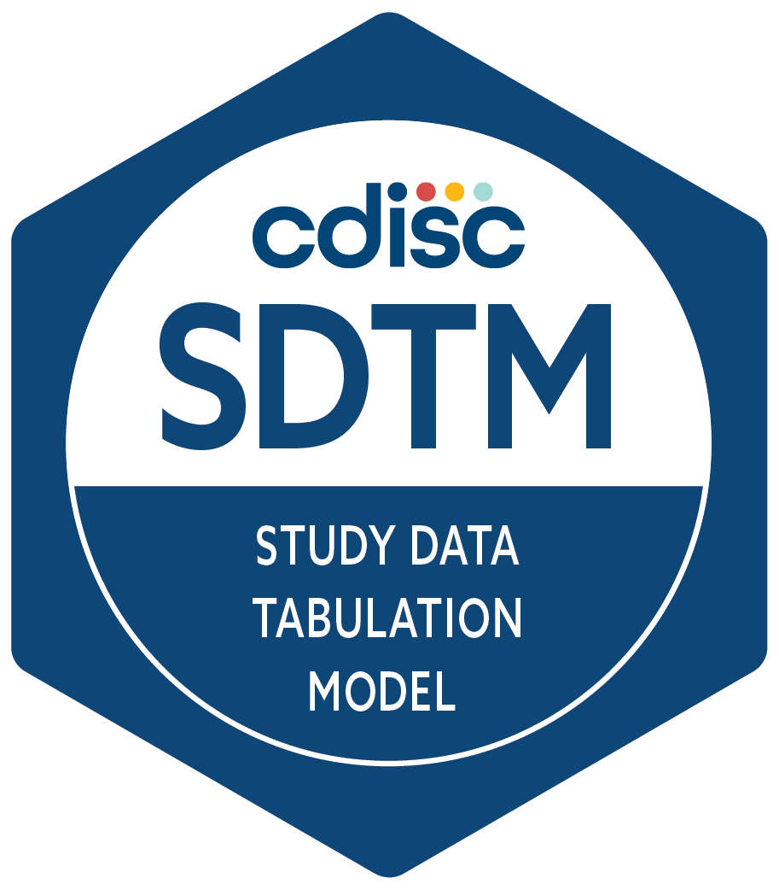
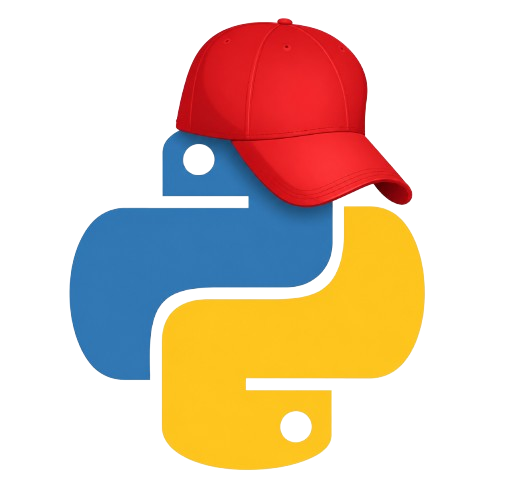

# 🐍 REDCap SDTM Automation
<p align="left">
  
  &nbsp;&nbsp;&nbsp;
  
</p>

**Complete Pipeline [SDTM Mapper + aCRF generator]**
- 📕 REDCap_SDTM.ipynb

Separated aCRF generation script  
- 📄 Gen_aCRF.ipynb

Separated SDTM Mapping script  
- 📄 Gen_SDTM_Map.ipynb 

```text
REDCap Data Dictionary
        +
Annotated PDF external module
      │
      ▼
Python / Google Colab
      │
      ├──► SDTM Mapping Specification
      ├──► SDTM-Annotated CRF
      ├──► Controlled Terminology
      └──► Codelists
```
## 🔍 Overview

This project provides a Google Colab notebook for generating CDISC SDTM mapping specifications and SDTM-annotated Case Report Forms (CRFs) from REDCap metadata and SDTM annotations.

The workflow uses SDTM annotations defined in REDCap field annotations and the PDF generated by the external module `Annotated PDF`.

The notebook extracts and organizes the SDTM mapping information associated with CRF variables and generates structured outputs for mapping specification development and review.

📗 The script generates:

- An Excel file with SDTM mapping specification;
- Identification of all SDTM variables mapped to the CRF;
- Associated SDTM controlled terminology and codelists;
- REDCap choices and alternative terms;
- Similarity based relationships between SDTM Submission Values and REDCap terms.
  
📗 The generated Excel file has 5 sheets:

- `Dataset Metadata` (Every domain in the CRF and its description)
- `Variable Metadata` (Every SDTM domain, variable and testcd in the CRF)
- `REDCap Values` (REDCap Submission Values)
- `Variables Codelists` (Codelist (if applicable) of every previously mapped SDTM variable)
- `Controlled Terminology` (REDCap Submission Terms linked by similarity to SDTM preferred terms)

📑 The script also generates:

- A SDTM-annotated CRF based on the PDF generated by the external module `Annotated PDF`.

The project was inspired by the REDCap2SDTM approach described by Yamamoto et al. [1], while providing additional functionality for the organization of SDTM mapping specifications, controlled terminology, REDCap alternatives, similarity-based term matching, and the generation of an SDTM-annotated CRF.

## 🔴 Does the script generate full SDTM Datasets?

This workflow DOES NOT generate submission ready SDTM datasets. Instead, it aims to make the SDTM dataset development process easier and more structured.

The workflow starts with an template eCRF containing SDTM annotations in the REDCap field annotations. These annotations are then used to generate SDTM mapping specifications and annotated CRFs.

The resulting outputs provide a structured reference for the relationship between CRF variables and SDTM domains, variables, controlled terminology, and codelists. This information can then be used to support the development of SDTM datasets using tools such as SAS or SDTM.OAK.

In addition, the similarity based search between REDCap submission terms and SDTM Preferred Terms can support the standardization of older, non-standardized eCRFs. By identifying potential relationships between terms used in older REDCap eCRF instruments and standardized SDTM terminology, the workflow can help facilitate the mapping and subsequent development of SDTM datasets from previously collected data.

In other words, the workflow helps establish a structured bridge between eCRF design, SDTM mapping, legacy data standardization, and subsequent dataset programming.

Having an annotated CRF generated as soon as the eCRF is moved into production can hopefully speedup the SDTM Programming part, be usefull for learning CDISC and training new interns and speedup the eCRF revisions by clinical programming leads, as the aCRF can be generated very quickly and in every step of the CRF development.


## ⚙ Workflow

The general workflow is:


```text
      SDTM Field Annotations [REDCap] 🟥
                │
                ▼
          Data Dictionary [REDCap] 🟥
                │
                ▼
     Field Annotation Extraction [Python] 🐍
                │
                ▼
  REDCap Submission Values Extraction [Python] 🐍
                │
                ▼
      Dataset Metadata Extraction [Python] 🐍
                │
                ▼
   CRF-Specific Codelist Generation [Python] 🐍
                │
                ▼
Study-Specific Controlled Terminology [Python] 🐍
          Generation by Similarity
```

```text
          Annotated PDF [REDCap] 🟥
                    +
     Previously Generated File [Excel] 📗
                    │
                    ▼
        SDTM Annotated CRF [Python] 🐍
```

## ✏ Field Annotation Mechanism

The user manually defines the SDTM annotation for each REDCap field using the Field Annotation field. These annotations are subsequently read by the pipeline and used to support the mapping of REDCap data to SDTM domains and variables.

The annotation approach is based on the mechanism implemented by `REDCap2SDTM` [1].

SDTM:IT.(domain name).(variable name).(test code);

Example 1. SDTM:IT.VS.VSORRES.SYSBP;

Example 2. SDTM:IT.AE.AETERM;

Example 3. SDTM:IT.SUPPDM.QVAL.MARISTAT 

Example 3.1. SDTM:IT.SUPPDM.TESTCD.MARISTAT

## 💡 Features To Be Added

✒ Annotated CRF script non dependant of the external module "Annotated PDF"

✒ Possibility of recording both the TESTCD as well as the TEST description in the REDCap Field Annotation to further optimize the dataset programming.

- SDTM:IT.(domain name).(variable name).(test code).(test description);

## 📌 References

[1] Yamamoto K, Ota K, Akiya I, Shintani A. A pragmatic method for transforming clinical research data from the research electronic data capture (REDCap) to Clinical Data Interchange Standards Consortium (CDISC) Study Data Tabulation Model (SDTM): Development and evaluation of REDCap2SDTM. *Journal of Biomedical Informatics*. 2017;70:65–76. https://doi.org/10.1016/j.jbi.2017.05.003

[2] Matsuzaki K, Kitayama M, Yamamoto K, Aida R, Imai T, Ishida M, Katafuchi R, Kawamura T, Yokoo T, Narita I, Suzuki Y. A pragmatic method to integrate data from preexisting cohort studies using the Clinical Data Interchange Standards Consortium (CDISC) Study Data Tabulation Model: case study. *JMIR Medical Informatics*. 2023;11:e46725. https://doi.org/10.2196/46725
